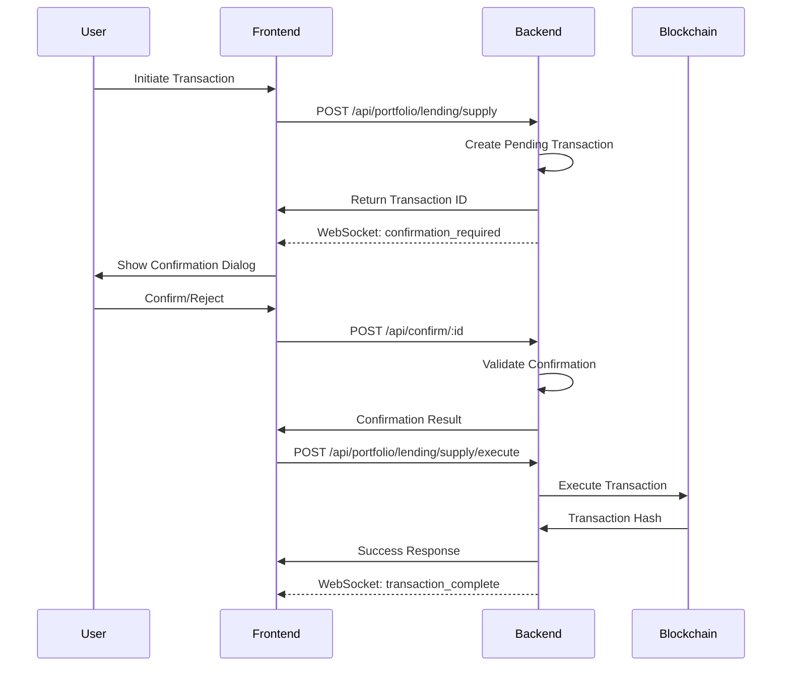

# Confirmation Flow Documentation

## Overview

The confirmation flow provides a secure way to handle transaction approvals without requiring private keys. Users must explicitly confirm transactions before they are executed on-chain.

## Architecture

### Core Components

1. **ConfirmationService** (`services/ConfirmationService.ts`)
   - Manages pending transactions
   - Handles confirmation/rejection logic
   - Implements expiration and cleanup

2. **ConfirmationHandler** (from core library)
   - Risk analysis and assessment
   - User-friendly confirmation formatting
   - Retry logic for unclear responses

3. **WebSocket Integration** (`services/SocketService.ts`)
   - Real-time confirmation requests
   - Status updates
   - Transaction notifications

4. **REST API Endpoints** (`routes/confirmation.ts`)
   - `/api/confirm/:transactionId` - Confirm transaction
   - `/api/reject/:transactionId` - Reject transaction
   - `/api/pending/:walletAddress` - Get pending transactions
   - `/api/transaction/:transactionId` - Get transaction details

## Transaction Flow



## API Usage

### Creating a Pending Transaction

```typescript
POST /api/portfolio/lending/supply
{
  "walletAddress": "0x123...",
  "asset": "0xSEI...",
  "amount": "1000",
  "requireConfirmation": true  // Triggers confirmation flow
}

Response:
{
  "success": true,
  "data": {
    "transactionId": "uuid-here"
  },
  "requiresConfirmation": true
}
```

### Confirming a Transaction

```typescript
POST /api/confirm/uuid-here
{
  "walletAddress": "0x123..."
}

Response:
{
  "success": true,
  "data": {
    "transactionId": "uuid-here",
    "confirmed": true,
    "timestamp": 1234567890
  }
}
```

### Executing Confirmed Transaction

```typescript
POST /api/portfolio/lending/supply/execute
{
  "transactionId": "uuid-here",
  "walletAddress": "0x123..."
}

Response:
{
  "success": true,
  "data": {
    "txHash": "0xabc...",
    "newSnapshot": { ... }
  }
}
```

## WebSocket Events

### Outgoing Events (Frontend → Backend)

- `confirm_transaction` - Confirm a pending transaction
- `reject_transaction` - Reject a pending transaction
- `get_pending_transactions` - Request all pending transactions

### Incoming Events (Backend → Frontend)

- `confirmation_required` - New transaction requires confirmation
- `transaction_confirmed` - Transaction was confirmed
- `transaction_rejected` - Transaction was rejected
- `transaction_expired` - Transaction expired
- `pending_transactions` - List of pending transactions

## Risk Assessment

Transactions are analyzed for various risk factors:

### Risk Levels
- **Critical**: Very high risk, requires immediate attention
- **High**: Significant risk, careful consideration needed
- **Medium**: Moderate risk, standard precautions apply
- **Low**: Minimal risk, informational only

### Risk Types
- **Large Amount**: Transaction value exceeds thresholds
- **High Leverage**: Leveraged positions with liquidation risk
- **Price Impact**: Significant market impact expected
- **New Protocol**: Using unfamiliar protocols
- **Gas Costs**: High transaction fees

## Transaction Types

### Lending Operations
- `supply` - Supply assets to lending protocol
- `withdraw` - Withdraw supplied assets
- `borrow` - Borrow against collateral
- `repay` - Repay borrowed assets

### Liquidity Operations
- `addLiquidity` - Provide liquidity to pools
- `removeLiquidity` - Remove liquidity from pools
- `collectFees` - Collect earned fees

### Swap Operations
- `swap` - Exchange one token for another

## Configuration

### Timeout Settings
- Default: 5 minutes (300000ms)
- Configurable per transaction type
- Automatic cleanup of expired transactions

### Security Features
- Wallet address validation
- Transaction ownership verification
- Expiration enforcement
- Duplicate confirmation prevention

## Error Handling

Common error scenarios:
- `Transaction not found` - Invalid transaction ID
- `Transaction already confirmed/rejected` - Duplicate action
- `Transaction expired` - Timeout exceeded
- `Unauthorized` - Wallet address mismatch

## Frontend Integration Example

```typescript
// Setup WebSocket connection
const socket = io('http://localhost:8000');
socket.emit('join_portfolio', walletAddress);

// Listen for confirmation requests
socket.on('portfolio_update', (update) => {
  if (update.type === 'confirmation_required') {
    const { transactionId, transaction } = update.data;
    
    // Show confirmation UI
    showConfirmationDialog({
      id: transactionId,
      summary: transaction.summary,
      risks: transaction.risks,
      expiresAt: transaction.expiresAt
    });
  }
});

// Handle user confirmation
async function confirmTransaction(transactionId: string) {
  await fetch(`/api/confirm/${transactionId}`, {
    method: 'POST',
    headers: { 'Content-Type': 'application/json' },
    body: JSON.stringify({ walletAddress })
  });
}
```

## Best Practices

1. **Always show risk warnings** prominently in the UI
2. **Implement countdown timers** for transaction expiration
3. **Provide clear transaction summaries** with expected outcomes
4. **Allow users to reject** with optional reasons
5. **Handle expired transactions** gracefully in the UI
6. **Batch similar operations** to reduce confirmation fatigue
7. **Store confirmation preferences** for trusted operations

## Testing

Run confirmation flow tests:
```bash
npm test -- confirmation
```

See `examples/confirmation-flow-example.ts` for detailed implementation examples.