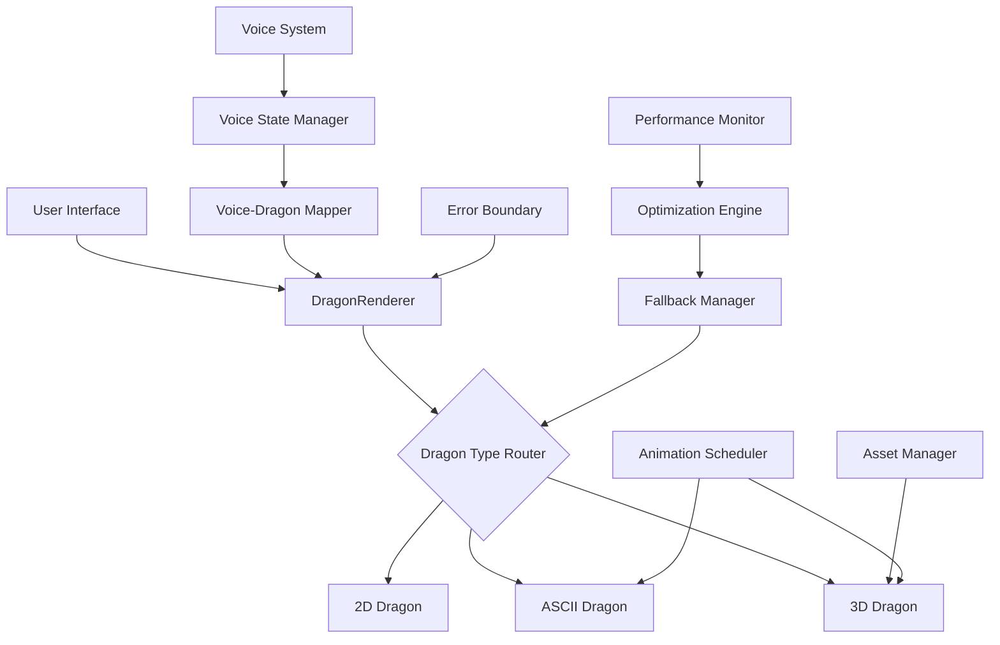

# 🐉 Dragon System Architecture Overview

This document provides a comprehensive technical overview of the Seiron dragon animation system architecture. From high-level design principles to detailed implementation patterns, this guide explains how the dragon system achieves scalability, performance, and maintainability.

## 🏗️ System Architecture

### High-Level Architecture



### Core Design Principles

1. **Functional Programming First**
   - Pure functions for business logic
   - Immutable state management
   - Effect isolation with fp-ts TaskEither

2. **Component Composition**
   - Small, focused components
   - Higher-order components for shared behavior
   - Render props for flexible composition

3. **Performance by Design**
   - Lazy loading and code splitting
   - Automatic performance monitoring
   - Progressive enhancement

4. **Type Safety**
   - Strict TypeScript throughout
   - Runtime type validation
   - Exhaustive pattern matching

5. **Graceful Degradation**
   - Multi-tier fallback system
   - Capability detection
   - Progressive feature enhancement

## 🎭 Component Architecture

### DragonRenderer - Unified Interface

The `DragonRenderer` acts as a facade pattern, providing a unified interface while managing complexity internally.

```typescript
// Architectural pattern: Facade + Strategy + Factory
interface DragonRenderer {
  // Facade: Simple external interface
  render(type: DragonType, props: DragonProps): ReactElement
  
  // Strategy: Pluggable dragon implementations
  strategies: Map<DragonType, DragonStrategy>
  
  // Factory: Dynamic component creation
  createDragon(type: DragonType): DragonComponent
}

// Implementation architecture
class DragonRendererImpl implements DragonRenderer {
  private strategyRegistry = new Map<DragonType, DragonStrategy>([
    ['2d', new SimpleDragonStrategy()],
    ['3d', new Dragon3DStrategy()],
    ['ascii', new ASCIIDragonStrategy()]
  ])
  
  private fallbackChain: FallbackChain = new FallbackChain([
    '3d', 'ascii', '2d'
  ])
  
  private performanceMonitor: PerformanceMonitor = new PerformanceMonitor()
}
```

### Strategy Pattern for Dragon Types

Each dragon type implements a common strategy interface while maintaining type-specific optimizations.

```typescript
// Base strategy interface
interface DragonStrategy {
  canRender(capabilities: DeviceCapabilities): boolean
  render(props: DragonProps): TaskEither<Error, ReactElement>
  cleanup(): TaskEither<Error, void>
  getPerformanceMetrics(): PerformanceMetrics
}

// 3D Dragon Strategy
class Dragon3DStrategy implements DragonStrategy {
  private webglContext: WebGLRenderingContext | null = null
  private threeScene: THREE.Scene = new THREE.Scene()
  
  canRender(capabilities: DeviceCapabilities): boolean {
    return capabilities.hasWebGL && 
           capabilities.memoryLimit > 256 &&
           capabilities.performanceScore > 30
  }
  
  render(props: Dragon3DProps): TE.TaskEither<Error, ReactElement> {
    return pipe(
      this.initializeWebGL(),
      TE.chain(() => this.createScene()),
      TE.chain(() => this.renderDragon(props)),
      TE.mapLeft(this.handleError)
    )
  }
}

// ASCII Dragon Strategy  
class ASCIIDragonStrategy implements DragonStrategy {
  private animationScheduler: AnimationScheduler = new AnimationScheduler()
  
  canRender(): boolean {
    return true // ASCII always works
  }
  
  render(props: ASCIIDragonProps): TE.TaskEither<Error, ReactElement> {
    return pipe(
      this.validateProps(props),
      TE.chain(() => this.renderASCII(props)),
      TE.chain(() => this.startAnimations(props))
    )
  }
}
```

## 🔄 State Management Architecture

### Functional State Management with fp-ts

The dragon system uses functional programming patterns for predictable state management.

```typescript
// State is managed through pure functions and TaskEither
type DragonState = {
  readonly type: DragonType
  readonly props: DragonProps
  readonly performance: PerformanceMetrics
  readonly errors: readonly Error[]
  readonly fallbackLevel: number
}

// State transitions are pure functions
const updateDragonType = (newType: DragonType) => 
  (state: DragonState): TE.TaskEither<Error, DragonState> =>
    pipe(
      validateDragonType(newType),
      TE.map(validType => ({
        ...state,
        type: validType,
        fallbackLevel: 0
      }))
    )

// State effects are isolated in TaskEither
const applyPerformanceOptimization = (state: DragonState): TE.TaskEither<Error, DragonState> =>
  pipe(
    getPerformanceRecommendation(state.performance),
    TE.chain(recommendation => applyOptimization(recommendation)),
    TE.map(optimizedProps => ({
      ...state,
      props: optimizedProps
    }))
  )
```

### Voice Integration State Flow

Voice state flows through the system using reactive patterns with RxJS.

```typescript
// Voice state is managed reactively
class VoiceStateManager {
  private voiceState$ = new BehaviorSubject<VoiceAnimationState>(initialVoiceState)
  private dragonMappings$ = new Map<DragonType, Observable<DragonProps>>()
  
  constructor() {
    // Each dragon type maps voice state differently
    this.dragonMappings$.set('ascii', this.createASCIIMapping())
    this.dragonMappings$.set('3d', this.create3DMapping())
    this.dragonMappings$.set('2d', this.create2DMapping())
  }
  
  private createASCIIMapping(): Observable<ASCIIDragonProps> {
    return this.voiceState$.pipe(
      map(voiceState => ({
        pose: this.mapVoiceToPose(voiceState),
        speed: this.mapVoiceToSpeed(voiceState),
        enableBreathing: voiceState.isListening || voiceState.isSpeaking,
        characterIntensity: voiceState.volume || 0.5
      })),
      distinctUntilChanged(),
      debounceTime(50) // Prevent excessive updates
    )
  }
}
```

## ⚡ Performance Architecture

### Multi-Layer Performance Optimization

The dragon system implements performance optimization at multiple architectural layers.

```typescript
// Layer 1: Component Level Performance
class PerformanceOptimizedDragon extends React.Component {
  // Memoization at component level
  shouldComponentUpdate(nextProps: DragonProps): boolean {
    return !isEqual(this.props, nextProps)
  }
  
  // Lazy loading of heavy components
  private lazyLoad3D = lazy(() => import('./Dragon3D'))
  
  render() {
    return (
      <Suspense fallback={<DragonSkeleton />}>
        {this.renderOptimizedDragon()}
      </Suspense>
    )
  }
}

// Layer 2: Animation Performance
class AnimationOptimizer {
  private performanceScore: number = 100
  private adaptiveSettings: AdaptiveSettings = new AdaptiveSettings()
  
  optimizeAnimations(dragonType: DragonType): AnimationConfig {
    if (this.performanceScore < 30) {
      return this.adaptiveSettings.getLowPerformanceConfig(dragonType)
    } else if (this.performanceScore < 70) {
      return this.adaptiveSettings.getMediumPerformanceConfig(dragonType)
    }
    return this.adaptiveSettings.getHighPerformanceConfig(dragonType)
  }
}

// Layer 3: System Level Performance
class SystemPerformanceManager {
  private memoryMonitor = new MemoryMonitor()
  private cpuMonitor = new CPUMonitor()
  private gpuMonitor = new GPUMonitor()
  
  async getSystemRecommendations(): Promise<SystemRecommendations> {
    const [memory, cpu, gpu] = await Promise.all([
      this.memoryMonitor.getCurrentUsage(),
      this.cpuMonitor.getCurrentLoad(),
      this.gpuMonitor.getCapabilities()
    ])
    
    return new SystemRecommendations(memory, cpu, gpu)
  }
}
```

### Fallback Chain Architecture

The fallback system implements a chain of responsibility pattern for graceful degradation.

```typescript
// Fallback chain with automatic recovery
class FallbackChain {
  private chain: FallbackHandler[] = [
    new Dragon3DFallbackHandler(),
    new ASCIIDragonFallbackHandler(),
    new SimpleDragonFallbackHandler()
  ]
  
  async handleFailure(
    error: Error, 
    currentType: DragonType, 
    context: RenderContext
  ): Promise<FallbackResult> {
    
    for (const handler of this.chain) {
      if (handler.canHandle(error, currentType)) {
        const result = await handler.handle(error, context)
        
        if (result.success) {
          return result
        }
      }
    }
    
    // Final fallback: static image
    return {
      success: true,
      dragonType: 'static',
      component: <StaticDragonImage />
    }
  }
}

// Individual fallback handlers
class Dragon3DFallbackHandler implements FallbackHandler {
  canHandle(error: Error, currentType: DragonType): boolean {
    return currentType === '3d' && this.isWebGLError(error)
  }
  
  async handle(error: Error, context: RenderContext): Promise<FallbackResult> {
    // Try to recover WebGL context
    const recovered = await this.tryWebGLRecovery()
    
    if (!recovered) {
      // Fallback to ASCII with similar visual characteristics
      return {
        success: true,
        dragonType: 'ascii',
        component: <ASCIIDragon pose="coiled" size={context.size} />,
        reason: 'WebGL not available'
      }
    }
    
    return { success: false }
  }
}
```

## 🎤 Voice Integration Architecture

### Event-Driven Voice System

The voice integration uses an event-driven architecture with clear separation of concerns.

```typescript
// Voice event system
class VoiceEventSystem {
  private eventBus = new EventBus()
  private speechRecognition = new SpeechRecognitionService()
  private textToSpeech = new TextToSpeechService()
  private dragonResponder = new DragonVoiceResponder()
  
  constructor() {
    this.setupEventHandlers()
  }
  
  private setupEventHandlers() {
    // Speech recognition events
    this.speechRecognition.on('start', () => {
      this.eventBus.emit('voice:listening:start')
    })
    
    this.speechRecognition.on('result', (transcript: string) => {
      this.eventBus.emit('voice:transcript', { transcript })
    })
    
    // TTS events
    this.textToSpeech.on('start', () => {
      this.eventBus.emit('voice:speaking:start')
    })
    
    // Dragon response events
    this.eventBus.on('voice:*', (event: VoiceEvent) => {
      this.dragonResponder.handleVoiceEvent(event)
    })
  }
}

// Dragon voice responder
class DragonVoiceResponder {
  private activeDragons = new Map<string, DragonComponent>()
  
  handleVoiceEvent(event: VoiceEvent): void {
    const mappedDragonEvents = this.mapVoiceEventToDragonEvents(event)
    
    for (const [dragonId, dragon] of this.activeDragons) {
      for (const dragonEvent of mappedDragonEvents) {
        dragon.handleEvent(dragonEvent)
      }
    }
  }
  
  private mapVoiceEventToDragonEvents(voiceEvent: VoiceEvent): DragonEvent[] {
    switch (voiceEvent.type) {
      case 'voice:listening:start':
        return [
          { type: 'dragon:state:change', payload: { state: 'listening' } },
          { type: 'dragon:animation:trigger', payload: { animation: 'alert' } }
        ]
        
      case 'voice:speaking:start':
        return [
          { type: 'dragon:state:change', payload: { state: 'speaking' } },
          { type: 'dragon:animation:trigger', payload: { animation: 'breathe-fire' } }
        ]
        
      default:
        return []
    }
  }
}
```

## 🔧 Asset Management Architecture

### Efficient Asset Loading and Caching

The dragon system implements sophisticated asset management for optimal performance.

```typescript
// Asset management system
class DragonAssetManager {
  private cache = new LRUCache<string, Asset>(100)
  private loaders = new Map<AssetType, AssetLoader>()
  private preloader = new AssetPreloader()
  
  constructor() {
    this.loaders.set('texture', new TextureLoader())
    this.loaders.set('model', new ModelLoader())
    this.loaders.set('audio', new AudioLoader())
    this.loaders.set('font', new FontLoader())
  }
  
  async loadAsset<T extends Asset>(
    assetId: string, 
    type: AssetType
  ): Promise<T> {
    // Check cache first
    const cached = this.cache.get(assetId)
    if (cached) {
      return cached as T
    }
    
    // Load asset with appropriate loader
    const loader = this.loaders.get(type)
    if (!loader) {
      throw new Error(`No loader available for asset type: ${type}`)
    }
    
    const asset = await loader.load<T>(assetId)
    
    // Cache loaded asset
    this.cache.set(assetId, asset)
    
    return asset
  }
  
  // Preload assets for better performance
  async preloadDragonAssets(dragonType: DragonType): Promise<void> {
    const assetManifest = this.getAssetManifest(dragonType)
    
    await Promise.all(
      assetManifest.map(asset => 
        this.preloader.preload(asset.id, asset.type)
      )
    )
  }
}

// Progressive asset loading
class ProgressiveAssetLoader {
  async loadWithProgression<T>(
    assets: AssetDescriptor[],
    onProgress?: (progress: number) => void
  ): Promise<T[]> {
    const results: T[] = []
    
    for (let i = 0; i < assets.length; i++) {
      const asset = await this.loadAsset<T>(assets[i])
      results.push(asset)
      
      onProgress?.(((i + 1) / assets.length) * 100)
    }
    
    return results
  }
}
```

## 🧪 Testing Architecture

### Comprehensive Testing Strategy

The dragon system implements multiple testing layers for reliability and maintainability.

```typescript
// Test architecture overview
class DragonTestSuite {
  // Unit tests for individual components
  private unitTests = new UnitTestSuite([
    new DragonRendererUnitTests(),
    new ASCIIDragonUnitTests(),
    new Dragon3DUnitTests(),
    new VoiceIntegrationUnitTests()
  ])
  
  // Integration tests for component interactions
  private integrationTests = new IntegrationTestSuite([
    new DragonVoiceIntegrationTests(),
    new PerformanceFallbackTests(),
    new AssetLoadingTests()
  ])
  
  // End-to-end tests for complete user flows
  private e2eTests = new E2ETestSuite([
    new DragonAnimationFlowTests(),
    new VoiceInteractionFlowTests(),
    new PerformanceOptimizationFlowTests()
  ])
  
  // Visual regression tests
  private visualTests = new VisualTestSuite([
    new DragonRenderingTests(),
    new AnimationConsistencyTests(),
    new ResponsiveLayoutTests()
  ])
}

// Property-based testing for dragon behavior
class DragonPropertyTests {
  testDragonProperties() {
    fc.assert(fc.property(
      arbitraryVoiceState(),
      arbitraryDragonType(),
      (voiceState, dragonType) => {
        const dragon = createDragon(dragonType, { voiceState })
        
        // Property: Dragon should always respond to voice state
        return dragon.currentState.voiceResponsive === true
      }
    ))
    
    fc.assert(fc.property(
      arbitraryPerformanceMetrics(),
      (metrics) => {
        const optimizations = getPerformanceOptimizations(metrics)
        
        // Property: Optimizations should improve or maintain performance
        return optimizations.estimatedImprovement >= 0
      }
    ))
  }
}
```

## 📊 Monitoring and Observability

### Performance and Error Monitoring

The dragon system includes comprehensive monitoring for production use.

```typescript
// Monitoring system architecture
class DragonMonitoringSystem {
  private metricsCollector = new MetricsCollector()
  private errorTracker = new ErrorTracker()
  private performanceAnalyzer = new PerformanceAnalyzer()
  
  // Real-time performance monitoring
  startPerformanceMonitoring(): void {
    this.metricsCollector.start([
      new FPSMetric(),
      new MemoryMetric(),
      new RenderTimeMetric(),
      new DragonSpecificMetrics()
    ])
    
    // Send metrics to analytics
    this.metricsCollector.on('metrics', (metrics) => {
      this.sendToAnalytics(metrics)
    })
  }
  
  // Error tracking with context
  trackError(error: Error, context: DragonContext): void {
    const enrichedError = {
      ...error,
      dragonType: context.dragonType,
      deviceCapabilities: context.deviceCapabilities,
      performanceMetrics: context.performanceMetrics,
      timestamp: Date.now(),
      sessionId: context.sessionId
    }
    
    this.errorTracker.track(enrichedError)
  }
  
  // Performance analysis and recommendations
  async analyzePerformance(): Promise<PerformanceReport> {
    const metrics = await this.metricsCollector.getRecentMetrics()
    const analysis = await this.performanceAnalyzer.analyze(metrics)
    
    return {
      overallScore: analysis.score,
      bottlenecks: analysis.bottlenecks,
      recommendations: analysis.recommendations,
      optimizations: analysis.optimizations
    }
  }
}
```

## 🔮 Extensibility Architecture

### Plugin System for Dragon Extensions

The dragon system supports extensibility through a plugin architecture.

```typescript
// Plugin system for extending dragon functionality
interface DragonPlugin {
  name: string
  version: string
  compatibleDragonTypes: DragonType[]
  
  onInstall(context: DragonContext): Promise<void>
  onUninstall(context: DragonContext): Promise<void>
  
  extend(dragon: DragonComponent): ExtendedDragonComponent
}

// Plugin manager
class DragonPluginManager {
  private plugins = new Map<string, DragonPlugin>()
  private activePlugins = new Set<string>()
  
  async installPlugin(plugin: DragonPlugin): Promise<void> {
    // Validate plugin compatibility
    await this.validatePlugin(plugin)
    
    // Install plugin
    this.plugins.set(plugin.name, plugin)
    
    // Activate for compatible dragons
    for (const dragon of this.getActiveDragons()) {
      if (plugin.compatibleDragonTypes.includes(dragon.type)) {
        await this.activatePluginForDragon(plugin, dragon)
      }
    }
  }
  
  private async activatePluginForDragon(
    plugin: DragonPlugin, 
    dragon: DragonComponent
  ): Promise<void> {
    const extendedDragon = plugin.extend(dragon)
    this.replaceDragon(dragon.id, extendedDragon)
  }
}

// Example plugin: Advanced particle effects
class AdvancedParticlePlugin implements DragonPlugin {
  name = 'advanced-particles'
  version = '1.0.0'
  compatibleDragonTypes: DragonType[] = ['3d']
  
  extend(dragon: Dragon3DComponent): ExtendedDragonComponent {
    return new ExtendedDragon3D(dragon, {
      particleEffects: new AdvancedParticleSystem(),
      lightingEffects: new AdvancedLightingSystem(),
      audioEffects: new SpatialAudioSystem()
    })
  }
}
```

## 🎯 Deployment Architecture

### Production Deployment Considerations

The dragon system is architected for scalable production deployment.

```typescript
// Production configuration management
class ProductionDragonConfig {
  private static getOptimalConfig(): DragonSystemConfig {
    const deviceCapabilities = DeviceCapabilityDetector.detect()
    const networkConditions = NetworkConditionDetector.detect()
    
    return {
      // CDN configuration for assets
      assetCDN: process.env.DRAGON_ASSET_CDN_URL,
      
      // Feature flags for A/B testing
      features: {
        enable3DDragons: FeatureFlag.isEnabled('3d-dragons'),
        enableVoiceIntegration: FeatureFlag.isEnabled('voice-integration'),
        enableAdvancedParticles: FeatureFlag.isEnabled('advanced-particles')
      },
      
      // Performance settings based on device
      performance: {
        defaultDragonType: this.getDefaultDragonType(deviceCapabilities),
        enableFallbacks: true,
        performanceMode: this.getPerformanceMode(deviceCapabilities),
        maxMemoryUsage: this.getMemoryLimit(deviceCapabilities)
      },
      
      // Monitoring configuration
      monitoring: {
        enablePerformanceTracking: true,
        enableErrorTracking: true,
        sampleRate: this.getSampleRate(networkConditions)
      }
    }
  }
}

// Service worker for dragon asset caching
class DragonServiceWorker {
  private static readonly DRAGON_CACHE = 'dragon-assets-v1'
  
  async handleFetch(event: FetchEvent): Promise<Response> {
    const url = new URL(event.request.url)
    
    // Cache dragon assets
    if (this.isDragonAsset(url)) {
      return this.cacheFirst(event.request)
    }
    
    // Network first for dynamic content
    return this.networkFirst(event.request)
  }
  
  private async cacheFirst(request: Request): Promise<Response> {
    const cache = await caches.open(this.DRAGON_CACHE)
    const cached = await cache.match(request)
    
    if (cached) {
      return cached
    }
    
    const response = await fetch(request)
    cache.put(request, response.clone())
    
    return response
  }
}
```

## 📋 Architecture Summary

### Key Architectural Patterns

1. **Facade Pattern** - DragonRenderer provides unified interface
2. **Strategy Pattern** - Different dragon implementations
3. **Chain of Responsibility** - Fallback system
4. **Observer Pattern** - Voice state propagation
5. **Factory Pattern** - Dynamic component creation
6. **Decorator Pattern** - Plugin system
7. **Singleton Pattern** - Asset management
8. **Command Pattern** - Animation system

### Architecture Benefits

- **Scalability** - Modular design supports growth
- **Maintainability** - Clear separation of concerns
- **Performance** - Multi-layer optimization
- **Reliability** - Comprehensive error handling
- **Extensibility** - Plugin architecture
- **Testability** - Dependency injection and mocking

### Design Trade-offs

| Aspect | Benefit | Trade-off |
|--------|---------|-----------|
| Functional Programming | Predictability, testability | Learning curve, verbosity |
| TypeScript Strict Mode | Type safety, tooling | Development overhead |
| Multi-layer Fallbacks | Reliability | Code complexity |
| Performance Monitoring | Optimization insights | Runtime overhead |
| Plugin Architecture | Extensibility | API maintenance |

## 🚀 Future Architecture Evolution

### Planned Architectural Improvements

1. **Micro-frontend Architecture**
   - Separate dragon types into independent micro-frontends
   - Runtime composition and loading
   - Independent deployment cycles

2. **WebAssembly Integration**
   - High-performance dragon physics in WASM
   - Complex animations and calculations
   - Cross-platform compatibility

3. **Edge Computing**
   - Asset optimization at edge locations
   - Regional performance adaptations
   - Reduced latency for dragon loading

4. **AI-Driven Optimization**
   - Machine learning for performance prediction
   - Automatic fallback decision making
   - Personalized dragon experiences

---

## 🎯 Conclusion

The Seiron dragon system architecture demonstrates how modern software engineering principles can create scalable, maintainable, and performant animation systems. Through careful application of design patterns, functional programming, and performance optimization, the system achieves its goals of providing engaging dragon animations across all devices and conditions.

**Key Architectural Strengths:**
- **Modularity** - Clear component boundaries and responsibilities
- **Resilience** - Robust error handling and fallback systems
- **Performance** - Multi-layer optimization strategies
- **Extensibility** - Plugin architecture for future enhancements
- **Type Safety** - Comprehensive TypeScript coverage

The architecture supports the system's evolution while maintaining backward compatibility and performance standards. This foundation enables the dragon system to adapt to future requirements while continuing to deliver exceptional user experiences.

**Remember: Great architecture empowers great dragons!** 🐉🏗️