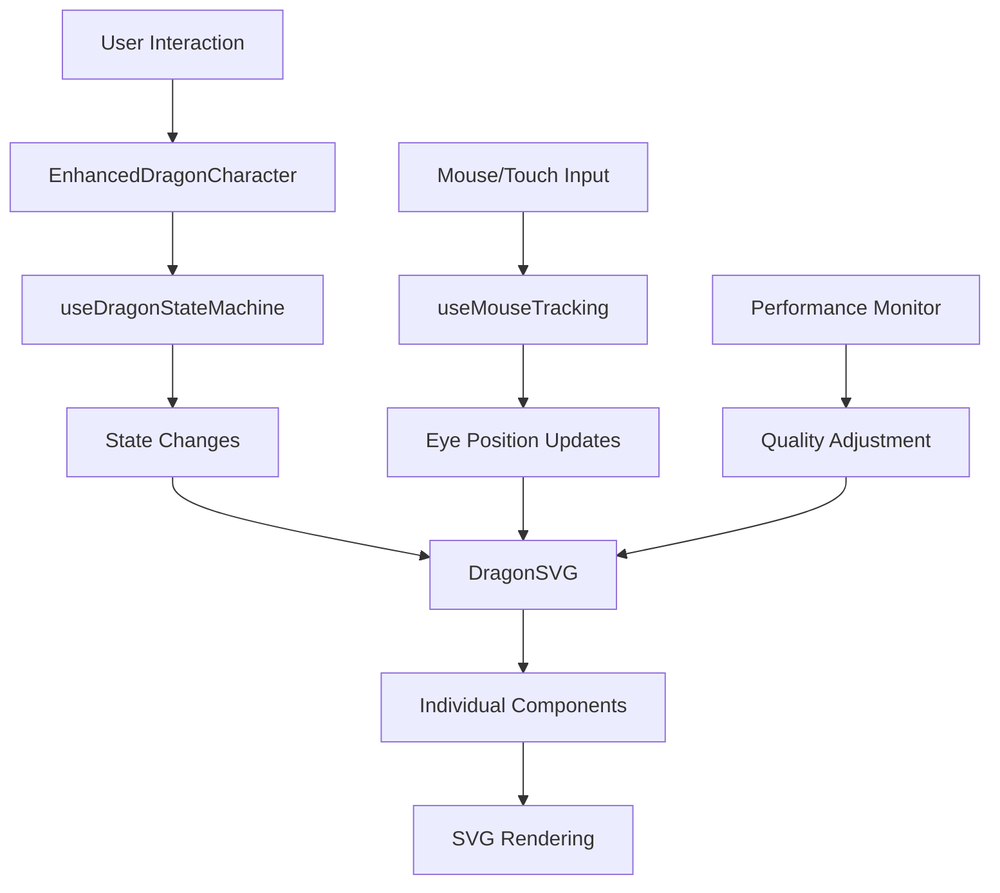

# SVG Dragon System Developer Guide

A comprehensive guide for developers integrating and customizing the SVG Dragon system in the Seiron DeFi platform.

## Table of Contents

1. [Overview](#overview)
2. [Architecture](#architecture)
3. [Integration Guide](#integration-guide)
4. [Advanced Configuration](#advanced-configuration)
5. [Performance Optimization](#performance-optimization)
6. [Accessibility Implementation](#accessibility-implementation)
7. [Custom Development](#custom-development)
8. [Troubleshooting](#troubleshooting)
9. [Best Practices](#best-practices)

## Overview

The SVG Dragon system is a modular, scalable, and performant animation framework built with React, TypeScript, and SVG. It replaces the legacy PNG-based dragon system with vector graphics for enhanced visual quality and better performance.

### Key Features
- **Modular Architecture**: Separate SVG components for each dragon part
- **Performance Optimized**: Adaptive quality levels and GPU acceleration
- **Accessibility First**: WCAG 2.1 AA compliant with screen reader support
- **Mobile Optimized**: Touch gestures and responsive design
- **Type Safe**: Full TypeScript support with comprehensive interfaces

### System Requirements
- React 18.0+
- TypeScript 4.9+
- Framer Motion 10.0+
- Tailwind CSS 3.0+

## Architecture

### Component Hierarchy

```
EnhancedDragonCharacter (Main Container)
├── DragonSVG (Core SVG Component)
│   ├── SVGGradients (Gradients & Filters)
│   ├── DragonTail (Background Layer)
│   ├── DragonBody (Middle Layer)
│   ├── DragonLimbs (Interactive Layer)
│   ├── DragonHead (Foreground Layer)
│   └── DragonEyes (Top Layer)
├── SVGDragonBalls (Orbital System)
├── DragonAura (Visual Effects)
└── DragonParticles (Particle System)
```

### Data Flow



## Integration Guide

### Basic Integration

#### Step 1: Install Dependencies

```bash
npm install framer-motion
npm install @types/react
```

#### Step 2: Import and Use

```tsx
import React from 'react'
import { EnhancedDragonCharacter } from '@/components/dragon'

export function MyDragonApp() {
  return (
    <div className="flex items-center justify-center min-h-screen">
      <EnhancedDragonCharacter
        size="lg"
        renderMode="svg"
        svgQuality="standard"
        enableSVGAnimations={true}
        interactive={true}
        showDragonBalls={true}
      />
    </div>
  )
}
```

### Advanced Integration

#### Custom Configuration

```tsx
import { EnhancedDragonCharacter, createDragonConfig } from '@/components/dragon'
import { detectDeviceType } from '@/utils'

export function AdvancedDragonApp() {
  const deviceType = detectDeviceType()
  
  const config = createDragonConfig('Balanced', {
    renderMode: 'svg',
    svgQuality: deviceType === 'mobile' ? 'minimal' : 'enhanced',
    enableSVGAnimations: deviceType !== 'mobile',
    animationConfig: {
      performanceMode: deviceType === 'mobile' ? 'performance' : 'quality',
      autoQualityAdjustment: true,
      enableParticles: deviceType !== 'mobile',
      enableAura: deviceType === 'desktop'
    },
    dragonBallConfig: {
      count: deviceType === 'mobile' ? 4 : 7,
      orbitPattern: 'elliptical',
      interactionEnabled: true
    }
  })

  return <EnhancedDragonCharacter {...config} />
}
```

#### Event Handling

```tsx
export function InteractiveDragonApp() {
  const handleStateChange = (state: DragonState) => {
    console.log('Dragon state changed:', state)
    // Analytics tracking
    analytics.track('dragon_state_change', { state })
  }

  const handlePowerLevelChange = (level: number) => {
    if (level > 9000) {
      // Trigger special effects or achievements
      showAchievement('Over 9000!')
    }
  }

  const handleInteraction = (type: InteractionType) => {
    switch (type) {
      case 'hover':
        // Show interaction hints
        showTooltip('Click to power up the dragon!')
        break
      case 'double-click':
        // Trigger special animation
        triggerSpecialEffect('dragon-roar')
        break
    }
  }

  return (
    <EnhancedDragonCharacter
      renderMode="svg"
      onStateChange={handleStateChange}
      onPowerLevelChange={handlePowerLevelChange}
      onInteraction={handleInteraction}
    />
  )
}
```

## Advanced Configuration

### Quality Management

#### Dynamic Quality Adjustment

```tsx
import { useAnimationPerformance } from '@/components/dragon/hooks'

export function AdaptiveDragonApp() {
  const { performanceMode, qualityLevel, metrics } = useAnimationPerformance(true)
  
  // Automatically adjust based on performance
  const svgQuality = useMemo(() => {
    if (qualityLevel < 40) return 'minimal'
    if (qualityLevel < 75) return 'standard'
    return 'enhanced'
  }, [qualityLevel])

  return (
    <div>
      <EnhancedDragonCharacter
        renderMode="svg"
        svgQuality={svgQuality}
        enableSVGAnimations={qualityLevel > 50}
        animationConfig={{
          performanceMode,
          autoQualityAdjustment: true
        }}
      />
      
      {/* Debug info */}
      <div className="fixed top-4 right-4 text-sm bg-black/80 text-white p-2 rounded">
        FPS: {metrics.fps} | Quality: {qualityLevel}%
      </div>
    </div>
  )
}
```

#### Custom Quality Presets

```tsx
const CUSTOM_QUALITY_PRESETS = {
  potato: {
    svgQuality: 'minimal' as const,
    enableSVGAnimations: false,
    animationConfig: {
      performanceMode: 'performance' as const,
      enableParticles: false,
      enableAura: false,
      particleCount: 0
    }
  },
  balanced: {
    svgQuality: 'standard' as const,
    enableSVGAnimations: true,
    animationConfig: {
      performanceMode: 'balanced' as const,
      enableParticles: true,
      enableAura: false,
      particleCount: 10
    }
  },
  ultra: {
    svgQuality: 'enhanced' as const,
    enableSVGAnimations: true,
    animationConfig: {
      performanceMode: 'quality' as const,
      enableParticles: true,
      enableAura: true,
      particleCount: 20
    }
  }
} as const

export function CustomQualityDragon({ preset = 'balanced' }) {
  const config = CUSTOM_QUALITY_PRESETS[preset]
  
  return (
    <EnhancedDragonCharacter
      renderMode="svg"
      {...config}
    />
  )
}
```

### State Management Integration

#### Redux Integration

```tsx
import { useSelector, useDispatch } from 'react-redux'
import { setDragonState, setPowerLevel } from '@/store/dragonSlice'

export function ReduxDragonApp() {
  const dispatch = useDispatch()
  const { state, powerLevel, mood } = useSelector(state => state.dragon)

  return (
    <EnhancedDragonCharacter
      renderMode="svg"
      initialState={state}
      initialMood={mood}
      onStateChange={(newState) => dispatch(setDragonState(newState))}
      onPowerLevelChange={(level) => dispatch(setPowerLevel(level))}
    />
  )
}
```

#### Context Integration

```tsx
const DragonContext = createContext<DragonContextType | null>(null)

export function DragonProvider({ children }: { children: React.ReactNode }) {
  const [dragonState, setDragonState] = useState<DragonState>('idle')
  const [powerLevel, setPowerLevel] = useState(1000)
  
  return (
    <DragonContext.Provider value={{
      state: dragonState,
      powerLevel,
      setState: setDragonState,
      setPowerLevel
    }}>
      {children}
    </DragonContext.Provider>
  )
}

export function ContextDragonApp() {
  const { state, powerLevel, setState, setPowerLevel } = useContext(DragonContext)!
  
  return (
    <EnhancedDragonCharacter
      renderMode="svg"
      initialState={state}
      onStateChange={setState}
      onPowerLevelChange={setPowerLevel}
    />
  )
}
```

## Performance Optimization

### Memory Management

```tsx
import { memo, useMemo, useCallback } from 'react'

// Memoize dragon component to prevent unnecessary re-renders
const MemoizedDragon = memo(EnhancedDragonCharacter)

export function OptimizedDragonApp() {
  // Memoize configuration to prevent object recreation
  const dragonConfig = useMemo(() => ({
    renderMode: 'svg' as const,
    svgQuality: 'standard' as const,
    enableSVGAnimations: true,
    animationConfig: {
      performanceMode: 'balanced' as const,
      autoQualityAdjustment: true
    }
  }), [])

  // Memoize event handlers
  const handleStateChange = useCallback((state: DragonState) => {
    console.log('State changed:', state)
  }, [])

  return (
    <MemoizedDragon
      {...dragonConfig}
      onStateChange={handleStateChange}
    />
  )
}
```

### Bundle Optimization

```tsx
// Lazy load dragon for better initial load times
import { lazy, Suspense } from 'react'

const LazyDragon = lazy(() => 
  import('@/components/dragon').then(module => ({
    default: module.EnhancedDragonCharacter
  }))
)

export function LazyLoadedDragonApp() {
  return (
    <Suspense fallback={
      <div className="flex items-center justify-center h-64">
        <div className="animate-spin rounded-full h-32 w-32 border-b-2 border-yellow-400" />
      </div>
    }>
      <LazyDragon renderMode="svg" />
    </Suspense>
  )
}
```

### Performance Monitoring

```tsx
import { usePerformanceMonitor } from '@/hooks'

export function MonitoredDragonApp() {
  const monitor = usePerformanceMonitor()
  
  useEffect(() => {
    monitor.start()
    
    return () => {
      monitor.stop()
      console.log('Dragon performance metrics:', monitor.getMetrics())
    }
  }, [monitor])

  return (
    <div>
      <EnhancedDragonCharacter
        renderMode="svg"
        animationConfig={{
          autoQualityAdjustment: true
        }}
      />
      
      {process.env.NODE_ENV === 'development' && (
        <div className="fixed bottom-4 left-4 bg-black/80 text-white p-4 rounded">
          <h3>Performance Metrics</h3>
          <p>FPS: {monitor.fps}</p>
          <p>Memory: {monitor.memoryUsage}MB</p>
          <p>GPU: {monitor.gpuUtilization}%</p>
        </div>
      )}
    </div>
  )
}
```

## Accessibility Implementation

### WCAG Compliance

```tsx
export function AccessibleDragonApp() {
  const [announcements, setAnnouncements] = useState<string[]>([])
  
  const handleStateChange = (state: DragonState) => {
    const announcement = `Dragon is now in ${state} state`
    setAnnouncements(prev => [...prev, announcement])
  }

  return (
    <div>
      <EnhancedDragonCharacter
        renderMode="svg"
        accessibilityConfig={{
          enableScreenReader: true,
          enableKeyboardNavigation: true,
          announceStateChanges: true,
          highContrastMode: 'auto',
          focusIndicators: true,
          ariaLabels: {
            dragon: 'Interactive Shenron Dragon',
            dragonBalls: 'Seven Dragon Balls in orbital pattern',
            powerLevel: 'Current dragon power level indicator',
            interactionHint: 'Use space bar or click to interact with the dragon'
          }
        }}
        onStateChange={handleStateChange}
      />
      
      {/* Screen reader announcements */}
      <div 
        aria-live="polite" 
        aria-atomic="true"
        className="sr-only"
      >
        {announcements[announcements.length - 1]}
      </div>
    </div>
  )
}
```

### Keyboard Navigation

```tsx
import { useKeyboardNavigation } from '@/components/dragon/hooks'

export function KeyboardNavigableDragon() {
  const { focusedElement, handleKeyDown } = useKeyboardNavigation({
    focusableElements: ['dragon', 'dragon-ball-1', 'dragon-ball-2'],
    onActivate: (element) => {
      console.log('Activated:', element)
    }
  })

  return (
    <div
      tabIndex={0}
      onKeyDown={handleKeyDown}
      className="focus:outline-none focus:ring-2 focus:ring-yellow-400"
    >
      <EnhancedDragonCharacter
        renderMode="svg"
        interactive={true}
        enableKeyboardNavigation={true}
      />
    </div>
  )
}
```

## Custom Development

### Creating Custom Dragon Components

```tsx
import { DragonSVG } from '@/components/dragon/svg'

export function CustomDragonVariant() {
  return (
    <div className="relative">
      {/* Custom background */}
      <div className="absolute inset-0 bg-gradient-to-r from-purple-900 to-blue-900 rounded-full blur-xl" />
      
      {/* Custom dragon with modified props */}
      <DragonSVG
        state="mystical"
        mood="powerful"
        powerLevel={7500}
        className="custom-dragon-variant"
        enableAnimations={true}
      />
      
      {/* Custom overlay effects */}
      <div className="absolute inset-0 pointer-events-none">
        <div className="absolute top-1/2 left-1/2 transform -translate-x-1/2 -translate-y-1/2">
          <div className="w-4 h-4 bg-purple-400 rounded-full animate-pulse" />
        </div>
      </div>
    </div>
  )
}
```

### Custom SVG Components

```tsx
import { DragonComponentProps } from '@/components/dragon/types'

export function CustomDragonWings({ 
  state, 
  mood, 
  powerIntensity, 
  gradientId 
}: DragonComponentProps) {
  const wingSpan = state === 'powering-up' ? 120 : 100
  const flapSpeed = mood === 'excited' ? '0.5s' : '2s'
  
  return (
    <g className="dragon-wings">
      {/* Left wing */}
      <path
        d={`M-${wingSpan} -20 Q-${wingSpan + 20} -40 -${wingSpan} -60 Q-${wingSpan - 10} -30 -${wingSpan} -20`}
        fill={`url(#${gradientId})`}
        className="wing-left"
        style={{
          animation: `wing-flap ${flapSpeed} ease-in-out infinite`,
          transformOrigin: '-60px 0px'
        }}
      />
      
      {/* Right wing */}
      <path
        d={`M${wingSpan} -20 Q${wingSpan + 20} -40 ${wingSpan} -60 Q${wingSpan - 10} -30 ${wingSpan} -20`}
        fill={`url(#${gradientId})`}
        className="wing-right"
        style={{
          animation: `wing-flap ${flapSpeed} ease-in-out infinite`,
          animationDelay: '0.1s',
          transformOrigin: '60px 0px'
        }}
      />
    </g>
  )
}
```

### Plugin System

```tsx
interface DragonPlugin {
  name: string
  install: (dragon: DragonInstance) => void
  uninstall: (dragon: DragonInstance) => void
}

const ParticleEffectPlugin: DragonPlugin = {
  name: 'ParticleEffect',
  install: (dragon) => {
    dragon.addEffect('particles', createParticleSystem())
  },
  uninstall: (dragon) => {
    dragon.removeEffect('particles')
  }
}

export function PluginBasedDragon() {
  const dragonRef = useRef<DragonInstance>(null)
  
  useEffect(() => {
    const dragon = dragonRef.current
    if (dragon) {
      ParticleEffectPlugin.install(dragon)
      return () => ParticleEffectPlugin.uninstall(dragon)
    }
  }, [])

  return (
    <EnhancedDragonCharacter
      ref={dragonRef}
      renderMode="svg"
      plugins={[ParticleEffectPlugin]}
    />
  )
}
```

## Troubleshooting

### Common Issues

#### Performance Problems

```tsx
// Problem: Low FPS with SVG rendering
// Solution: Use performance mode and reduce quality

export function PerformanceOptimizedDragon() {
  return (
    <EnhancedDragonCharacter
      renderMode="svg"
      svgQuality="minimal"              // Reduce quality
      enableSVGAnimations={false}       // Disable animations
      animationConfig={{
        performanceMode: 'performance', // Use performance mode
        enableParticles: false,         // Disable particles
        enableAura: false              // Disable aura
      }}
    />
  )
}
```

#### Memory Leaks

```tsx
// Problem: Memory increasing over time
// Solution: Proper cleanup and memoization

export function CleanDragonApp() {
  const dragonRef = useRef<HTMLDivElement>(null)
  
  useEffect(() => {
    const observer = new IntersectionObserver(
      (entries) => {
        entries.forEach(entry => {
          if (!entry.isIntersecting) {
            // Pause animations when not visible
            entry.target.classList.add('dragon-paused')
          } else {
            entry.target.classList.remove('dragon-paused')
          }
        })
      }
    )
    
    if (dragonRef.current) {
      observer.observe(dragonRef.current)
    }
    
    return () => {
      observer.disconnect()
    }
  }, [])

  return (
    <div ref={dragonRef}>
      <EnhancedDragonCharacter renderMode="svg" />
    </div>
  )
}
```

#### Touch Issues on Mobile

```tsx
// Problem: Touch interactions not working
// Solution: Enhanced touch handling

export function MobileFriendlyDragon() {
  return (
    <EnhancedDragonCharacter
      renderMode="svg"
      svgQuality="minimal"    // Better for mobile
      interactive={true}
      enableCursorTracking={false}  // Disable on mobile
      animationConfig={{
        performanceMode: 'performance'
      }}
      style={{
        touchAction: 'manipulation',  // Improve touch response
        userSelect: 'none'           // Prevent text selection
      }}
    />
  )
}
```

### Debug Tools

```tsx
export function DragonDebugger() {
  const [debugMode, setDebugMode] = useState(false)
  
  return (
    <div>
      <button onClick={() => setDebugMode(!debugMode)}>
        Toggle Debug Mode
      </button>
      
      <EnhancedDragonCharacter
        renderMode="svg"
        className={debugMode ? 'dragon-debug' : ''}
      />
      
      {debugMode && (
        <div className="debug-panel">
          <DragonStateInspector />
          <PerformanceMetrics />
          <SVGStructureViewer />
        </div>
      )}
    </div>
  )
}
```

## Best Practices

### 1. Performance

- Use `svgQuality="minimal"` on mobile devices
- Enable `autoQualityAdjustment` for adaptive performance
- Implement lazy loading for off-screen dragons
- Use `React.memo()` for dragon components
- Monitor FPS and adjust quality dynamically

### 2. Accessibility

- Always provide meaningful ARIA labels
- Implement keyboard navigation
- Use high contrast mode detection
- Provide screen reader announcements
- Test with actual screen readers

### 3. Mobile Optimization

- Use touch-friendly interaction areas (minimum 44px)
- Reduce particle count on mobile
- Disable complex animations on low-end devices
- Implement proper touch gesture handling
- Test on actual mobile devices

### 4. Code Organization

- Keep dragon configuration in separate files
- Use TypeScript for type safety
- Implement proper error boundaries
- Document custom configurations
- Follow consistent naming conventions

### 5. Testing

```tsx
// Example test for dragon component
import { render, fireEvent, screen } from '@testing-library/react'
import { EnhancedDragonCharacter } from '@/components/dragon'

describe('EnhancedDragonCharacter', () => {
  it('should render with SVG mode', () => {
    render(<EnhancedDragonCharacter renderMode="svg" />)
    
    const dragonSvg = screen.getByRole('img', { name: /shenron dragon/i })
    expect(dragonSvg).toBeInTheDocument()
  })
  
  it('should handle state changes', () => {
    const onStateChange = jest.fn()
    render(
      <EnhancedDragonCharacter
        renderMode="svg"
        onStateChange={onStateChange}
      />
    )
    
    const dragon = screen.getByRole('img')
    fireEvent.click(dragon)
    
    expect(onStateChange).toHaveBeenCalled()
  })
  
  it('should be accessible', async () => {
    render(<EnhancedDragonCharacter renderMode="svg" />)
    
    const dragon = screen.getByRole('img')
    expect(dragon).toHaveAttribute('aria-label')
    expect(dragon).toHaveAttribute('aria-describedby')
  })
})
```

---

## Conclusion

The SVG Dragon system provides a robust, scalable, and accessible foundation for dragon animations in the Seiron platform. By following this guide, developers can effectively integrate, customize, and optimize the dragon system for their specific needs.

For additional support and examples, refer to:
- [API Reference](./API_REFERENCE.md)
- [Performance Guide](./PERFORMANCE_GUIDE.md)
- [Accessibility Guide](./ACCESSIBILITY_GUIDE.md)
- [Example Implementations](../examples/dragon/)